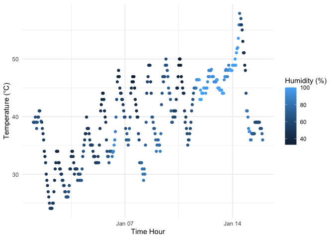

P8105 Homework1
================
Yuzhe Hu
2023-09-23

# Problem 1

``` r
library("moderndive")
data("early_january_weather")
```

- This dataset contains 15 variables, which are origin, year, month,
  day, hour, temp, dewp, humid, wind_dir, wind_speed, wind_gust, precip,
  pressure, visib, time_hour.

- The dataset has 358 rows and 15 columns.

- The mean of temperature is 39.5821229.

``` r
library(ggplot2)

# Draw the graph
scatter_plot = ggplot(early_january_weather, aes(x = time_hour, y = temp, color = humid)) +
  geom_point() + labs(x = "Time Hour", y = "Temperature (°C)", color = "Humidity (%)") + 
  theme_minimal() 
scatter_plot
```

<!-- -->

``` r
ggsave("scatter plot.png", scatter_plot)
```

The raw data package recorded data from 1:00 a.m. on January 1, 2013 to
23:00 p.m. on January 15, 2013, with time intervals of one recording
every one hour. There are three areas of interest in the above images:

- From the relationship between temperature and time, the daily
  temperatures fluctuated significantly and the overall temperature
  showed an increasing trend.
- The relationship between humidity and time shows that the humidity was
  much higher from about January 12, 2013 to January 14, 2013 compared
  to the other dates.
- It is difficult to summarize the relationship between temperature and
  humidity based on visual observation of this graph, as it seems that
  the humidity was lower when the daily temperatures were higher in a
  single day. However, there are outliers from January 12, 2013 to
  January 14, 2013, which suggests that humidity may be more
  significantly affected by other factors.
