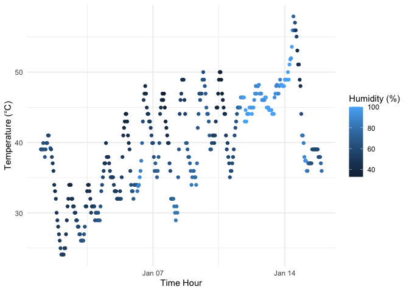

P8105 Homework1
================
Yuzhe Hu
2023-09-23

# Problem 1

## About the `early_january_weather` dataset

``` r
library("moderndive")
data("early_january_weather")
```

- This dataset contains 15 variables, which are origin, year, month,
  day, hour, temp, dewp, humid, wind_dir, wind_speed, wind_gust, precip,
  pressure, visib, time_hour.

- The dataset has 358 rows and 15 columns.

- The mean of temperature is 39.5821229.

## Scatter plot

<!-- -->

The raw data package recorded data from 1:00 a.m. on January 1, 2013 to
23:00 p.m. on January 15, 2013, with time intervals of one recording
every one hour. There are three areas of interest in the above image:

- From the relationship between temperature and time, the daily
  temperatures fluctuated significantly and the overall temperature
  showed an increasing trend.
- The relationship between humidity and time shows that the humidity was
  much higher from about January 12, 2013 to January 14, 2013 compared
  to the other dates.
- It is difficult to summarize the relationship between temperature and
  humidity based on visual observation of this graph, as it seems that
  the humidity was lower when the daily temperatures were higher in a
  single day. However, there are outliers from January 12, 2013 to
  January 14, 2013, which suggests that humidity may be more
  significantly affected by other factors.

# Problem 2

## Construct a dataframe

``` r
# Create the data frame
df = data.frame(
  random_numeric = rnorm(10),  # Random sample from a standard Normal distribution
  logical_vector = rnorm(10) > 0,  # Logical vector indicating if elements are > 0
  character_vector = sample(letters, 10, replace = TRUE),  # Character vector of length 10
  factor_vector = as.factor(sample(1:3, 10, replace = TRUE))  # Factor vector with 3 levels
)
```

## Calculate the mean

``` r
mean(df$random_numeric)  # Works
```

    ## [1] -0.2876988

``` r
mean(df$logical_vector)  # Works
```

    ## [1] 0.4

``` r
mean(df$character_vector)  # Doesn't work
```

    ## Warning in mean.default(df$character_vector): argument is not numeric or
    ## logical: returning NA

    ## [1] NA

``` r
mean(df$factor_vector)  # Doesn't work
```

    ## Warning in mean.default(df$factor_vector): argument is not numeric or logical:
    ## returning NA

    ## [1] NA

The calculation of mean works for numerical vectors and logical vectors,
and doesn’t work for character vectors and factor vectors. For the
logical vector here, this logical vector consists of “TRUE” and “FALSE”.
R assigns “TURE” to 1 and “FALSE” to 0 by default, and uses this to
calculate the mean of the logical vector.

## Apply `as.numeric()` function

Load the `tidyverse` package and use the `pull` function. Apply the
`as.numeric()` function to the logical, character, and factor vectors,
try to convert these vectors into numerical vectors and calculate their
mean.

``` r
# Load the tidyverse package
library(tidyverse)
# Apply as.numeric to the variables using pull
numeric_logical_vector = as.numeric(pull(df,logical_vector))
numeric_character_vector = as.numeric(pull(df,character_vector))
numeric_factor_vector = as.numeric(pull(df,factor_vector))
# Calculate the mean
mean(numeric_logical_vector) # Works
mean(numeric_character_vector) # Doesn't work
mean(numeric_factor_vector) # Works
```

After applying the `as.numeric()` function to the logical, character,
and factor vectors, the calculation of mean works for logical vectors
and factor vectors, but still doesn’t work for character vectors.

- For `numeric_logical_vector`, it composes of “0”s and “1”s where 0
  corresponds to FALSE and 1 corresponds to TRUR in `logical_vector`.
- For `numeric_character_vector`, each element of this vector is “NA”,
  so R can only output “NA” when calculating the mean.
- For `numeric_factor_vector`, it composes of numbers after numerical
  conversion from factor vectors as factor vectors have different
  levels, and R can do this conversion by some patterns and calculate
  the mean.
